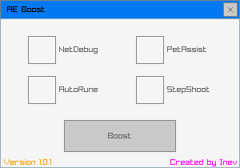

## Download

AEBoost can be downloaded [here](https://github.com/Tserith/AEBoost/releases/download/1.1.0/AEBoost.zip). You may optionally build it yourself.

*Note: A relaunch of the game will disable any mod unless AEBoost is running with it and "Boost" selected.*

## PetAssist

Pets default to assist mode. Press right alt to toggle with protect mode.

*Note: This will not be displayed in the follower window.*

## AutoRune

Spells can be freely cast between rune types. Rune swaps are done automatically when casting a spell of a different type or when low on charges.

## StepShoot

Shoot one ranged attack per step. Press tab to toggle.

*Note: This is not recommended for PvP since it is unable to vary your speed.*

## Create your own mod

1. Make a copy of `Mods\Template.cpp` and rename it to your desired mod name
2. Implement your mod by filling out the `Init<YourModName>` function.
3. Add `MOD(<YourModName>)` to `Mods/ModList.txt`
4. Build AEBoost

*Feel free to message @tserith on Discord if you have questions.*

## Building

CMake and Git must both be accessible from the Windows PATH to build AEBoost.

The Microsoft C/C++ compiler is also required (Visual Studio 2019+ recommended).

1. Run `build.bat`
2. Optionally open `build/AEBoost.sln` to edit and build with Visual Studio.
